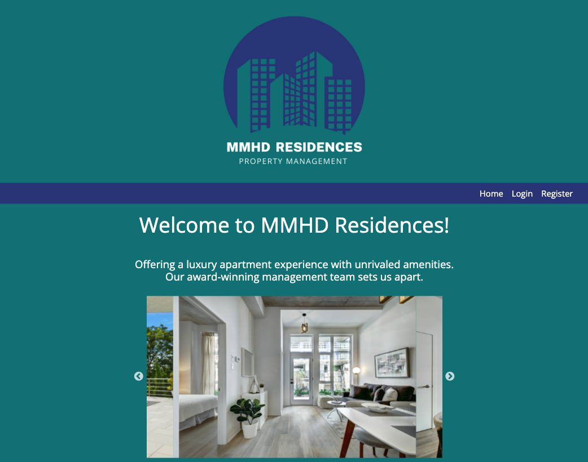
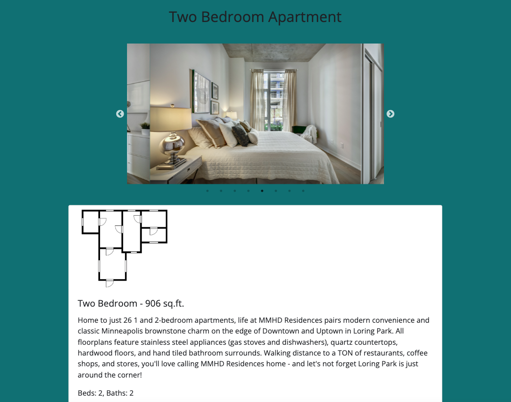
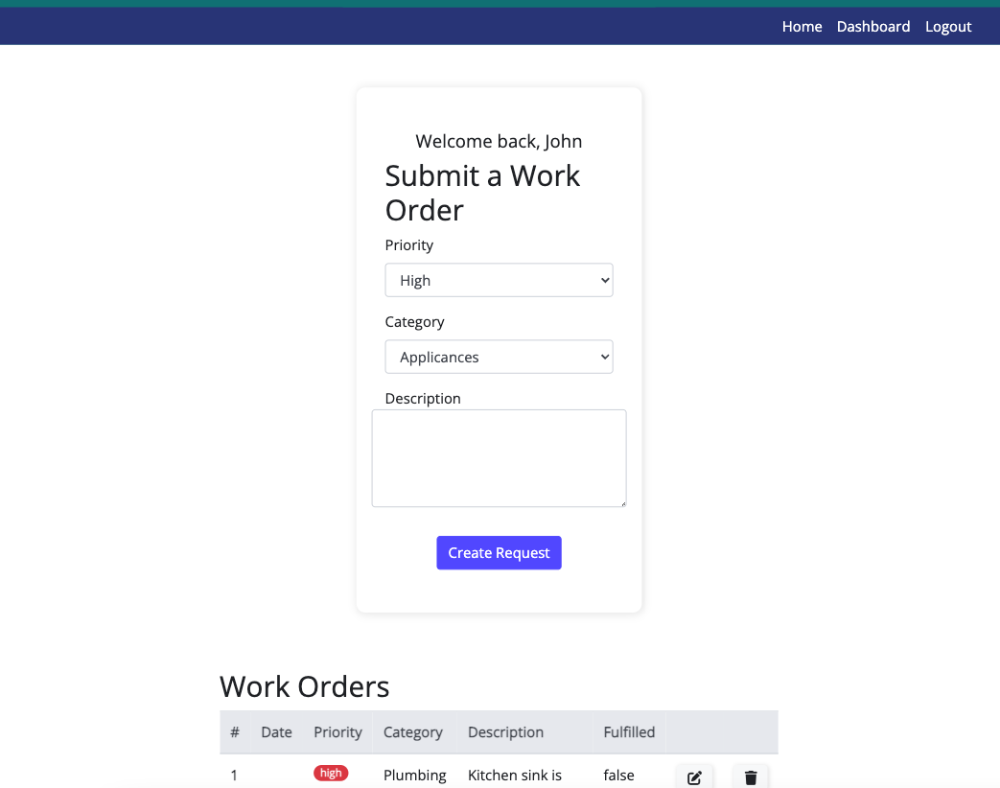
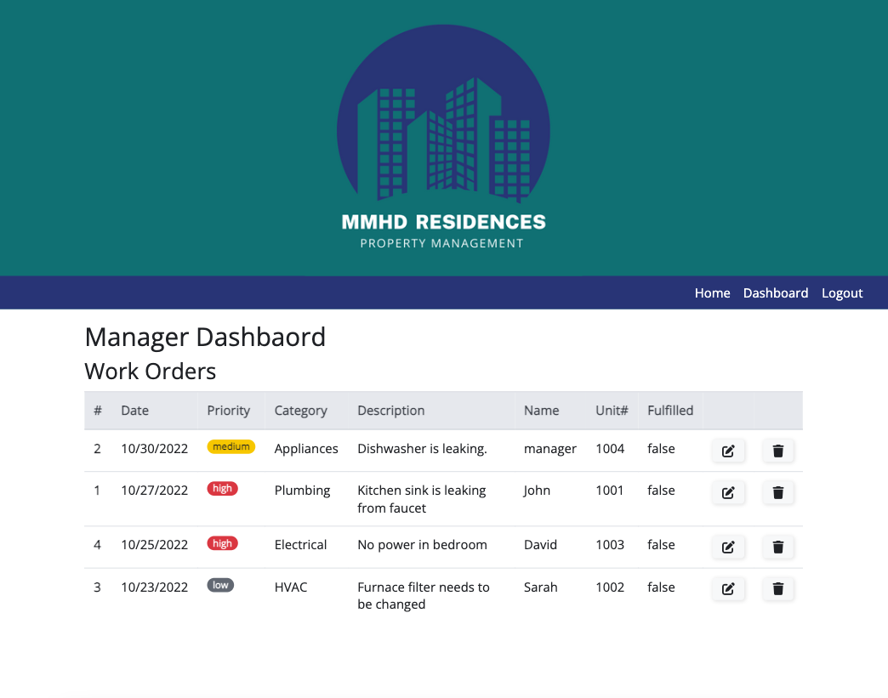

# MMHD Residences Property Management

## Description

MMHD Residences Property Management is an apartment complex offering luxury apartments and a quality management team. The website features both unrestricted content for potential tenants and restricted access to a user dashboard for current tenants and management.

The unrestricted content includes a homepage with a gallery of images and available floor plans. Current tenants have the ability to log into a user dashboard and submit work orders. The property manager can also login and view the work orders that have been submitted by tenants.  

This application uses the MVC paradigm for structure and Express Handlebars for templating. Using Express.js, API routes have been configured with Sequelize to interact with a MySQL database. The express-session package is used for user authentification. Image galleries were created using Slick-carousel.

## Team Members

The team behind MMHD Residences Property Management includes the following collaborators:

* Jared Mabus
* Mariam Mohamed
* Holly Hoffman
* Shannon Dann

## Table of Contents

- [Installation](#installation)
- [Usage](#usage)
- [Deployed Application](#deployed-application)
- [License](#license)
- [Contributing](#contributing)
- [Tests](#tests)
- [Questions](#questions)

## Installation 

Installation is not required: this application is deployed using Railway.

If you would like to run this application on your local machine, please use `npm i` to install all of the required packages found in the package.json file. 

* To create the tables for the database, add the db/schema.sql file data to your MySQL Workbench.

* Use `npm run seed` to seed the property management database.

* See the .envEXAMPLE file for the information needed to secure your connection to the database.

* Use `npm run start` to start the server.

## Usage 

Use of the website for unregistered guests allows for browsing the various apartment types and viewing a gallery of images. Clicking for more information brings the guest to a new page with details about that particular apartment. This includes:

* A detailed description

* Number of bedrooms and bathrooms

* Floor number

* Estimated monthly cost for rent

Current tenants with login credentials have access to their personal dashboard. Inside the dashboard, there is a form for submitting work orders to the management team and viewing work orders that have already been submitted. Work orders include the following information:

* Priority (High, Medium, or Low)

* Category (Appliances, Electrical, HVAC, or Plumbing)

* Text area for writing a description

Previously submitted work orders display the submission date, all information listed above, and options to edit or delete the work order.

The dashboard for property managers (users with admin rights) can view all work orders that have been submitted by tenants.

## Deployed Application

[MMHD Residences Property Management](https://propertymanager-production.up.railway.app/)

## License 

MMHD Residences Property Management is available under the MIT license.

Please see [LICENSE](./LICENSE) for the full details of the license.

## Contributing 

The contributors of this application have adopted the Contributor Covenant Code of Conduct. Please visit the [Code of Conduct](./CODE_OF_CONDUCT) page for details.

## Tests 

This application doesn't have any tests at this time.

## Questions 

Please reach out via the the link below with any additional questions. 

[GitHub](https://github.com/hoffh-5334/propertyManager)